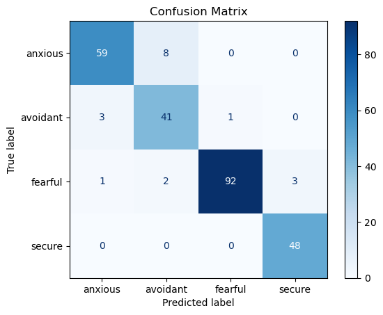

# Bağlanma Stili Tespiti (Attachment Style Prediction)

Bu proje, bireylerin psikolojik ve davranışsal verilerini analiz ederek temel bağlanma stillerini (Kaygılı, Kaçıngan, Korkulu, Güvenli) makine öğrenmesi algoritmalarıyla tahmin etmeyi amaçlayan bir Tübitak 2209-A çalışmasıdır.

##  Model Performans Analizi

Modelin sınıflandırma başarısını gösteren Karmaşıklık Matrisi (Confusion Matrix) aşağıdadır. Matris, modelin hangi sınıfları ne kadar doğru tahmin ettiğini ve hangi sınıfları birbirine karıştırdığını detaylıca göstermektedir.

  
   
  <i>Şekil 1: Modelin Duygu Sınıflandırma Başarımı (Karmaşıklık Matrisi)</i>

##  Teknik Detaylar
* **Geliştirme Ortamı:** Spyder IDE
* **Dil:** Python
* **Kütüphaneler:** Scikit-learn, Pandas, NumPy, Matplotlib, Seaborn
